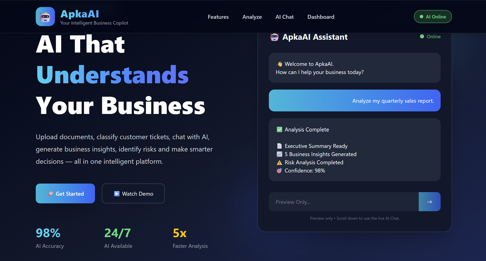
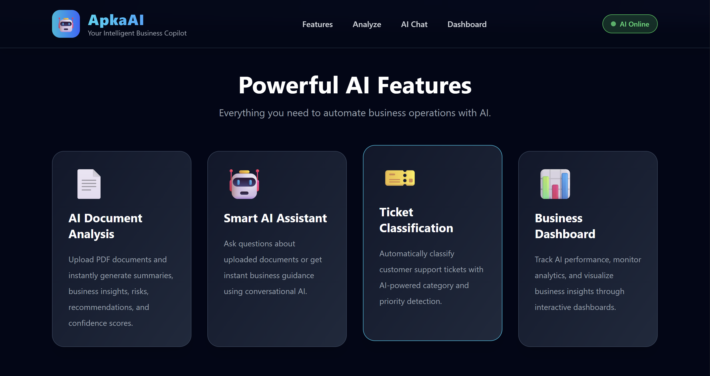
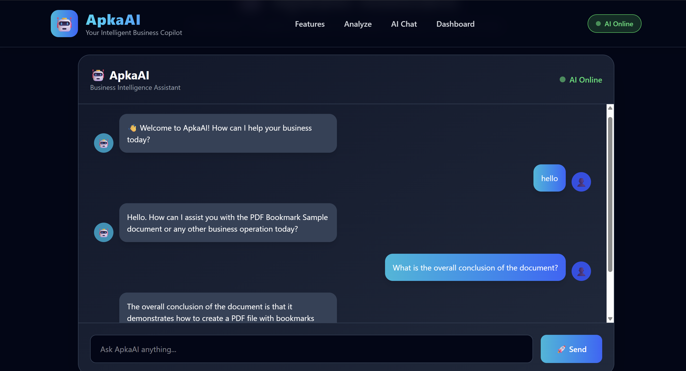
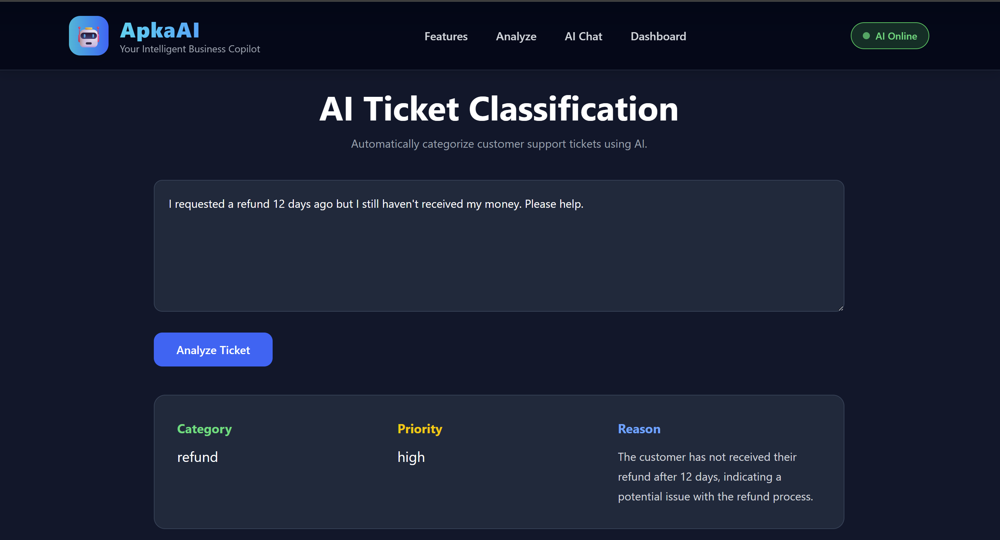
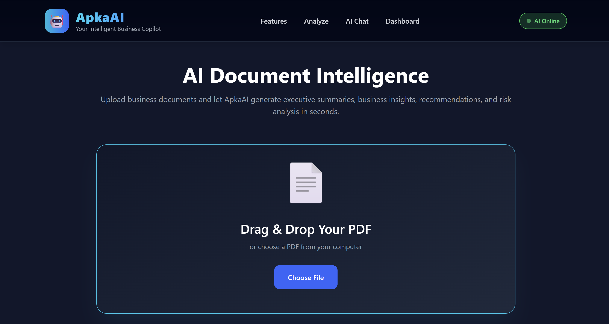
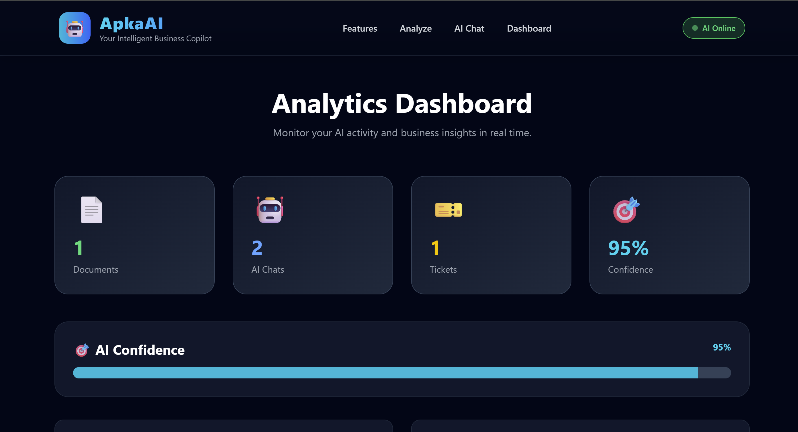
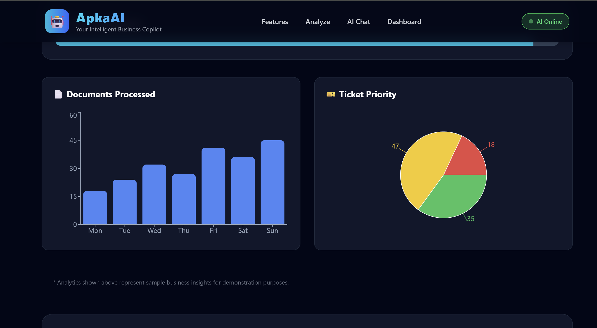

<div align="center">

# 🤖 ApkaAI
### Your Intelligent Business Copilot

AI-powered business assistant that helps organizations analyze documents, classify support tickets, generate business insights, and interact through an intelligent AI chatbot.

🌐 **Live Demo:** https://apka-ai.vercel.app

🎥 **Demo Video:** (Add your YouTube Link Here)

</div>

---

# 📌 Overview

ApkaAI is an AI-powered SaaS platform designed to simplify business operations.

It allows users to:

- 📄 Analyze PDF documents
- 🤖 Chat with AI
- 🎫 Classify customer support tickets
- 📊 Monitor AI usage with dashboards
- ⚡ Generate instant business insights

---

# 🚀 Features

- 📄 AI Document Intelligence
- 🤖 Smart AI Chat Assistant
- 🎫 AI Ticket Classification
- 📊 Business Analytics Dashboard
- ⚡ Fast AI Responses
- ☁️ Cloud Hosted
- 📱 Responsive UI

---

# 🛠 Tech Stack

## Frontend

- React.js
- Vite
- Tailwind CSS
- Framer Motion
- Recharts

## Backend

- Node.js
- Express.js
- Multer
- PDF Parse

## AI

- Groq API
- Llama 3.3 70B Versatile

## Deployment

- Vercel
- Render

---

# 📷 Screenshots

## 🏠 Home Page



---

## 🚀 Features



---

## 🤖 AI Chat Assistant



---

## 🎫 Ticket Classification



---

## 📄 AI Document Intelligence



---

## 📊 Analytics Dashboard



---

## 📈 Dashboard Charts



---

# ⚙️ Installation

Clone the repository

```bash
git clone https://github.com/YOUR_USERNAME/flowmind-ai.git
```

Move into project

```bash
cd flowmind-ai
```

Install dependencies

```bash
npm install
```

Frontend

```bash
cd frontend
npm install
npm run dev
```

Backend

```bash
cd backend
npm install
node server.js
```

---

# 🔑 Environment Variables

Backend

```env
GROQ_API_KEY=your_api_key
PORT=5000
```

Frontend

```env
VITE_API_URL=http://localhost:5000
```

For production:

```env
VITE_API_URL=https://your-render-url.onrender.com
```

---

# 📂 Project Structure

```
flowmind-ai
│
├── frontend
│   ├── src
│   ├── public
│   └── package.json
│
├── backend
│   ├── routes
│   ├── services
│   ├── server.js
│   └── package.json
│
├── assets
├── README.md
└── package.json
```

---

# 🎯 Future Enhancements

- User Authentication
- Team Collaboration
- Multi-language Support
- AI Report Export
- Database Integration
- Admin Dashboard
- Voice Assistant

---

# 👨‍💻 Author

**Sathwik Naik**

GitHub: https://github.com/YOUR_USERNAME

LinkedIn: https://linkedin.com/in/sathwik-naik-6a3030319/

---

# ⭐ Support

If you like this project, please consider giving it a ⭐ on GitHub!
